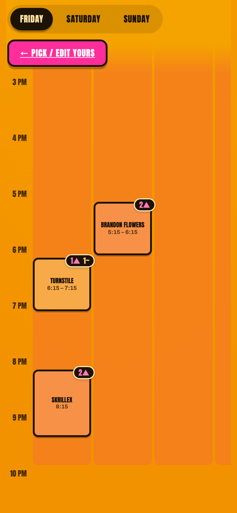

# ACL Weekend 1 — Schedule Planner

A shared planner for your friend group at **Austin City Limits 2026, Weekend One** (Oct 2–4).

<p>
  
  
  
</p>

## What it does

**Pick your sets** (open `/vote`)
- The full ACL schedule for Friday, Saturday and Sunday, laid out by stage and time
- Tap an artist, then mark it **Definitely** or **Maybe**
- Enter your name once; hit **Submit** when you're done and **Edit** any time to change
- Unsaved picks stick around if you close the page

**See the group's picks**
- One board showing every set someone picked
- Color shows how popular a set is, from a few people to crowd favorite
- Tap a set to see exactly who's going (and who's a maybe)
- Updates on its own as friends submit

**The Weekend** (open `/`)
- One timeline per day with the ACL sets your group picked and any plans people add (brunch, pregames, late shows)
- Anyone can add, edit or delete a plan, with a time, place and notes
- Sets or plans at the same time show side by side, so clashes are easy to spot
- Free time between things is shown, so you can see gaps in the day
- A map of Austin pins every plan; tap a pin to jump to it

<details>
<summary>Running it yourself</summary>

## Run locally

```
npm install
npm run dev
```

Open http://localhost:3000 (picks at http://localhost:3000/vote, results at http://localhost:3000/results).

## Test

```
npm test
```

## Deploy to Render (TLDR)

1. Push this repo to GitHub (done).
2. Render dashboard → **New → Blueprint** → pick this repo → **Apply**
   (uses `render.yaml`: Starter instance + 1GB disk so votes persist).
3. Wait for the build, then share the `…onrender.com` URL with your friends.

**Free instead of paid:** in `render.yaml` remove the `disk:` block and set
`plan: free`. Deploys at $0, but the free filesystem is ephemeral — votes can
reset on redeploy/restart. Fine for a quick weekend, not for long-term storage.

## Stack

Node + Express, `better-sqlite3`, vanilla HTML/CSS/JS. Schedule data lives in
`data/schedule.js` (the single source of truth for the grid and valid pick ids).

</details>
