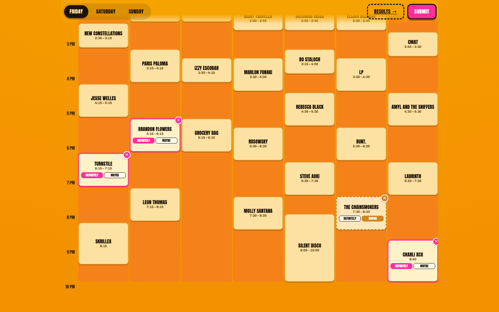
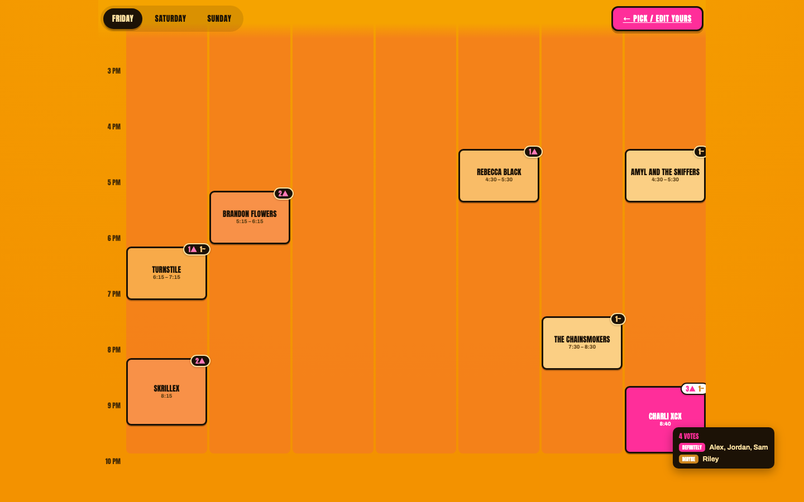
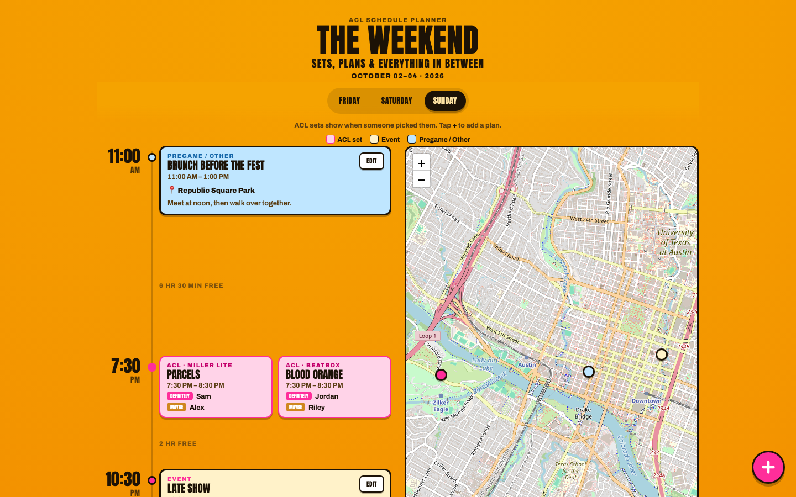
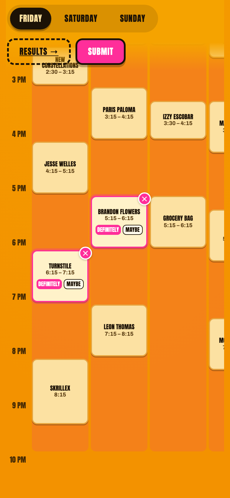
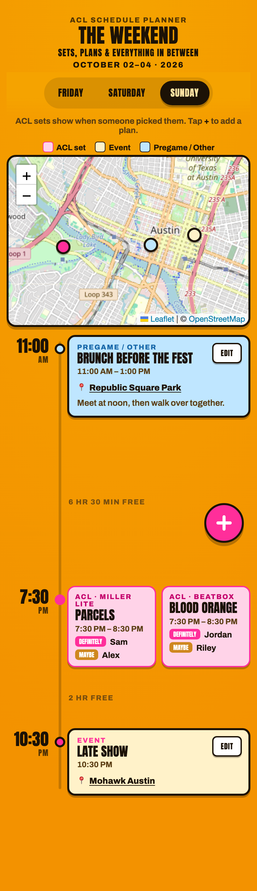

# ACL Weekend 1 — Schedule Planner

A shared planner for your friend group at **Austin City Limits 2026, Weekend One** (Oct 2–4).

## What it does

**Pick your sets**

- The full ACL schedule for Friday, Saturday and Sunday, laid out by stage and time
- Tap an artist, then mark it **Definitely** or **Maybe**
- Enter your name once; hit **Submit** when you're done and **Edit** any time to change
- Unsaved picks stick around if you close the page

**See the group's picks**

- One board showing every set someone picked
- Color shows how popular a set is, from a few people to crowd favorite
- Tap a set to see exactly who's going (and who's a maybe)
- Updates on its own as friends submit

**The Weekend** (open `/weekend`)

- One timeline per day with the ACL sets your group picked and any plans people add (brunch, pregames, late shows)
- Anyone can add, edit or delete a plan, with a time, place and notes
- Sets or plans at the same time show side by side, so clashes are easy to spot
- Free time between things is shown, so you can see gaps in the day
- A map of Austin pins every plan; tap a pin to jump to it

## On your phone

  
  

